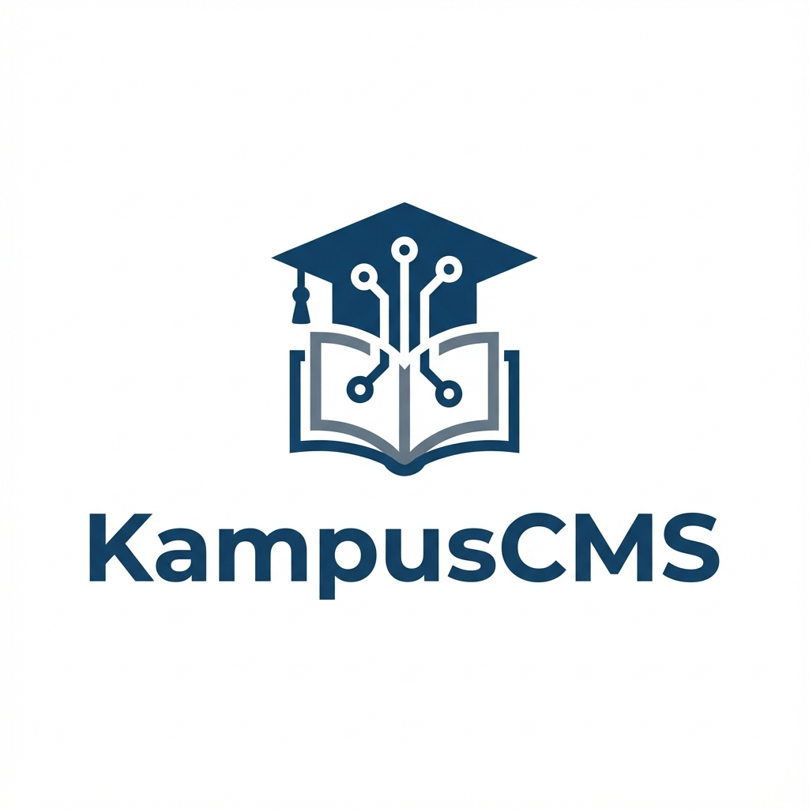

<div align="center">
  
  <h1>KampusCMS</h1>
</div>

**KampusCMS** adalah Content Management System (CMS) modern yang komprehensif dan mendukung **Multi-Tenant**, dirancang khusus untuk kebutuhan Perguruan Tinggi di Indonesia. Dibangun dengan teknologi web terkini, sistem ini memberikan pengalaman tanpa hambatan dalam mengelola portal akademik, website fakultas (multi-site), berita, agenda kegiatan, hingga data alumni dalam satu instalasi terpusat.

   

## ✨ Fitur Utama

### 🌐 Arsitektur Multi-Site & Multi-Tenant
-   **Satu Sistem, Banyak Website**: Kelola website utama universitas, landing page PMB (Penerimaan Mahasiswa Baru), atau website Fakultas/Prodi hanya dengan satu instalasi.
-   **Subdomain & Kustom Domain**: Dukungan penuh untuk subdomain (misal: `pmb.univ.ac.id`, `ft.univ.ac.id`) atau domain kustom terpisah.
-   **Pengaturan Granular**: Tiap situs memiliki pengaturan logo, warna tema, header, dan footer yang terpisah.

### 🏗️ Page Builder Canggih (No-Code)
-   **Drag-and-Drop Interface**: Bangun halaman responsif dengan mudah tanpa perlu coding.
-   **Pustaka Blok Lengkap**:
    -   **Layout**: Hero Section, Kolom Teks, Fitur, Pemisah (Separator).
    -   **Konten**: Editor Teks Kaya (Rich Text), Gambar, Video, Carousel, Galeri Foto.
    -   **Dinamis**: Grid Berita, Daftar Staff/Dosen, Kalender Agenda, Pusat Unduhan.
    -   **Integrasi**: RSS Feed (Berita Google), Embed Media Sosial (Instagram, TikTok, YouTube).
    -   **Akademik**: Statistik Tracer Study, Daftar Program Studi.
-   **Live Preview**: Edit tampilan secara real-time dengan kontrol tipografi yang presisi.

### 🏛️ Modul Akademik Terintegrasi
-   **Tracer Study**: Modul lengkap untuk melacak karir alumni dengan visualisasi statistik.
-   **Program Studi**: Manajemen data Program Studi, Kurikulum, dan Profil Lulusan.
-   **Staff & Dosen**: Direktori profil dosen dan tenaga kependidikan yang terintegrasi.
-   **Pusat Unduhan (Download Center)**: Distribusi dokumen akademik (SK, Panduan, Jurnal) yang terorganisir per kategori.
-   **Galeri Kegiatan**: Manajemen album foto kegiatan kampus.

### 🛠️ Administrasi Sistem
-   **Manajemen Hak Akses (RBAC)**: Dashboard aman dengan level akses untuk Super Admin, Admin Unit, Editor, dan Dosen.
-   **Manajer Media**: Pengelolaan file gambar dan dokumen terpusat.
-   **Backup & Restore**: Fitur pencadangan data penuh (Database + File) dan pemulihan sistem satu-klik untuk keamanan data.
-   **Pengaturan Situs**: Konfigurasi identitas kampus, SEO, dan kode pelacakan (Analytics) langsung dari dashboard.

## 🛠️ Teknologi yang Digunakan
1
-   **Framework**: [Next.js 15](https://nextjs.org/) (App Router)
-   **Bahasa**: TypeScript
-   **Database**: PostgreSQL
-   **ORM**: [Prisma](https://www.prisma.io/)
-   **UI Components**: [Shadcn UI](https://ui.shadcn.com/) + Tailwind CSS v4
-   **Autentikasi**: NextAuth.js (v5)
-   **Deployment**: Docker & Nginx
-   **Optimasi Gambar**: Sharp

## 🚀 Panduan Instalasi (Lokal)

1.  **Clone Repository**
    ```bash
    git clone https://github.com/imamimam13/kampusCMS.git
    cd kampusCMS
    ```

2.  **Install Dependencies**
    ```bash
    npm install
    ```

3.  **Konfigurasi Environment**
    Salin file `.env.example` menjadi `.env` dan sesuaikan koneksi database Anda:
    ```bash
    cp .env.example .env
    ```

4.  **Inisialisasi Database**
    ```bash
    npx prisma generate
    npx prisma db push
    ```
    *Opsional: Isi data awal (seeding)*
    ```bash
    npx prisma db seed
    ```

5.  **Jalankan Server Development**
    ```bash
    npm run dev
    ```
    Buka [http://localhost:3000](http://localhost:3000) untuk mengakses aplikasi.

## 🐳 Deployment (Docker / Portainer / CasaOS)

Proyek ini mendukung deployment otomatis menggunakan Docker.

### Arsitektur Container
-   **kampuscms**: Aplikasi utama Next.js (Port 3000 internal).
-   **db**: Database PostgreSQL.
-   **nginx**: Reverse proxy kustom (Port Host **8097**).
-   **watchtower**: Otomatisasi update container saat ada perubahan kode di repository.

### Langkah Deployment

1.  **Siapkan Stack**
    Salin file `docker-compose.yml` ke server Anda (Portainer/CasaOS/Docker Swarm).

2.  **Jalankan Stack**
    ```bash
    docker-compose up -d
    ```

3.  **Akses Website**
    -   Website Publik: `http://IP_SERVER_ANDA:8097`
    -   Panel Admin: `http://IP_SERVER_ANDA:8097/admin`

    > **Catatan:** Pastikan port 8097 terbuka di firewall server Anda.

### CI/CD Pipeline
Repository ini secara otomatis membuat docker image melalui GitHub Actions:
-   `imamwb/kampuscms:latest` (Aplikasi)
-   `imamwb/kampuscms-nginx:latest` (Konfigurasi Nginx)

Setiap push ke branch `main` akan memicu build ulang, dan Watchtower di server Anda akan otomatis menarik image terbaru.

## 📂 Struktur Proyek

```
├── prisma/               # Skema Database & Migrasi
├── public/               # Aset Statis
├── scripts/              # Skrip Pemeliharaan & Utilitas
├── src/
│   ├── app/              # Halaman Next.js (App Router)
│   ├── components/       # Komponen React Reusable
│   │   ├── admin/        # Komponen Dashboard Admin
│   │   ├── builder/      # Engine Page Builder
│   │   └── ...
│   ├── lib/              # Fungsi Utilitas (Database, Auth)
│   └── types/            # Definisi Tipe TypeScript
├── Dockerfile            # Konfigurasi Docker Aplikasi
├── Dockerfile.nginx      # Konfigurasi Docker Nginx
└── docker-compose.yml    # Konfigurasi Deployment Produksi
```

## 📝 Lisensi

[MIT](LICENSE)
